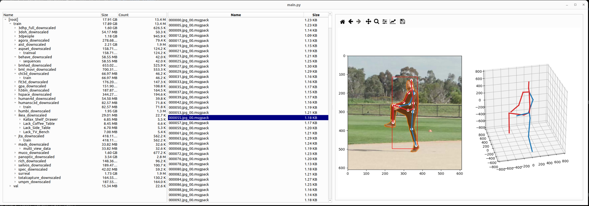

# PosePile

This is a large collection of dataset processing (and benchmark evaluation) scripts for image-based 3D human pose estimation, as used in the paper 

**Learning 3D Human Pose Estimation from Dozens of Datasets using a Geometry-Aware Autoencoder to Bridge Between Skeleton Formats** \
István Sárándi, Alexander Hermans, Bastian Leibe \
Winter Conference on Applications of Computer Vision (WACV), 2023


*(screenshot of [this GUI tool](https://github.com/isarandi/pose-dataset-viewer) displaying the full combined dataset)*

## Motivation

Recently, there has been an explosion of new 3D human pose estimation datasets available to the vision community, but each research paper typically only uses one or a few of them for training. We suspect that one major reason is that using each dataset requires figuring out its quirks, how it is stored and how it needs to be processed in Python (and another reason is the incompatible skeleton joint definitions, which we also address in [our paper](https://arxiv.org/abs/2212.14474)).

This repository is therefore intended to help by clearly defining out all processing steps, all the way from raw downloaded dataset files to final annotated examples, dealing with the unique quirks and tricks involved with each dataset.

As shown in the paper, it turns out that there is a large cumulative benefit in using 28 datasets (spanning over a decade of community effort) for training a single model.

## Structure

The repo is structured as follows. Each dataset has its own directory under `posepile/ds/$dataset_name`. Within that, there is a `main.sh` bash script listing the processing steps, and a `main.py` which is called from bash and contains a `make_dataset()` function. There are often additional scripts in the directory, depending on the dataset and the processing steps needed, and they are also called from `main.sh`. Corresponding benchmark evaluation scripts are named `eval.py` in the same directory (for the most common ones).

Typically, the preprocessing consists of downloading and extracting the dataset, some conversion or compression steps, camera calibration processing, person detection, person segmentation, adaptive selection of frames with enough motion, generation of smaller-resolution image crops and putting it all into a common format (`posepile.datases3D.Pose3DDataset` and `posepile.datases3D.Pose2DDataset`).

Running the preprocessing for all 28 datasets (as described in the paper referenced below) takes very long. The end result is 13 million image crops with corresponding annotations. The images in JPEG format take up around 1 TB of space, while the annotations (including masks stored in RLE format) take up about 20 GB. For more convenient use of this large data, the [BareCat](https://github.com/isarandi/BareCat) library can be used to store it in sharded archives that support fast random access during training, without high memory usage or having many small files.

Unfortunately, redistribution of the processed data is not possible due to the license terms of the original datasets (except for ASPset, which is in the public domain, and hence may be released here as an example in the future).

## Processing

Clone the repository, and run pip install.

```bash
git clone https://github.com/isarandi/PosePile.git
cd PosePile
pip install .
```

Configure where to put the data by defining an environment variable:

```bash
export DATA_ROOT=/path/to/created/data
```

Then for each dataset, inspect the `main.sh` script, e.g. `cat posepile/ds/aspset/main.sh`. Sometimes the downloading was not possible be automate, and you need to perform some initial downloads manually (this is indicated in comments within `main.sh`).

The steps in `main.sh` are **intended to be read and carefully executed step by step**, rather than blindly executing the whole script and expecting it to run through all at once. Since **processing each dataset can take anywhere from many hours to many days**, you will need to adapt these commands to your cluster environment, by deciding where to run each processing step (depending on whether e.g. GPUs are required or not etc.). Longer tasks are implemented in a way that easily lends itself to distributed processing via e.g., Slurm (so some scripts read the `SLURM_ARRAY_TASK_ID` environment variable). Resuming from various failures, and checking outputs may require manual interventions. In short, proceed by taking each line or block of lines in `main.sh`, run it and check that everything is going as expected. While this requires considerable manual effort, a large value of this codebase lies in precisely defining the necessary steps, showing how to deal with the quirks of each individual dataset, how exactly the raw dataset files need to be loaded and interpreted, etc.

## Merging Datasets

The individual datasets (pickled `Pose3DDataset` objects) can be combined into meta-datasets, for combined training purposes. Tools are defined for this in the `posepile/merging` directory.

However, simply combining the 28 datasets in this way results in a very large `Pose3DDataset` object (including the stored `Pose3DExample` objects), making this object-oriented storage with simlple pickling not practical for such large combinations. See the next section for a better storage option.

## Efficient Storage and Training via BareCat

Since the resulting data is very large (13 million JPEG files with corresponding annotations), training a pose estimator on it requires some considerations regarding storage and disk reading speed. For this, it is recommended to convert the resulting pickle file containing a `Pose3DDataset` (paths and annotations) to the [BareCat](https://github.com/isarandi/BareCat) format. BareCat consists of a barebones concatenation of many small files, as well as an SQLite index database mapping paths to offsets and sizes within the concatenated file. For the annotations, each example can be stored as a binary file inside the BareCat archive, by serializing it using msgpack-numpy. [A script](https://github.com/isarandi/PosePile/blob/main/posepile/tools/dataset_pickle_to_barecat.py) is provided to do this conversion. Similarly, the JPEG image files can also be concatenated to the BareCat format to avoid storing and loading many small files during training.

## Reference

Please consider citing the following paper if this code helps your research (along with any of the original dataset papers you use):

```bibtex
@inproceedings{Sarandi2023dozens,
    author = {S\'ar\'andi, Istv\'an and Hermans, Alexander and Leibe, Bastian},
    title = {Learning {3D} Human Pose Estimation from Dozens of Datasets using a Geometry-Aware Autoencoder to Bridge Between Skeleton Formats},
    booktitle = {IEEE/CVF Winter Conference on Applications of Computer Vision (WACV)},
    year = {2023}
} 
```
